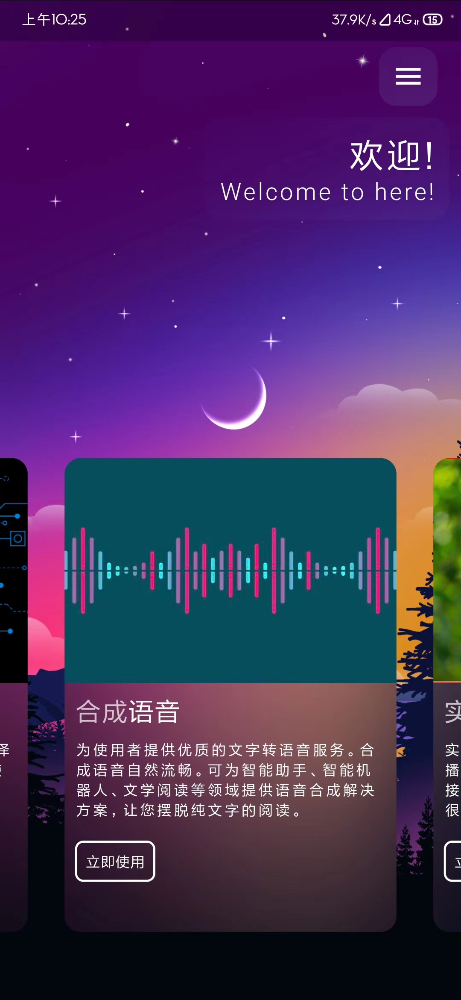

# flutter

安卓移动端的开发框架,开发语言为dart,[下载连接](https://yutianhui.lanzoui.com/imbM2hkgrvg)  

如果想要正常使用功能需要在腾讯申请Api接口,在lib/util下填写appKey和appId

# 版本

video_player: ^0.10.12  
flare_flutter: ^2.0.6  
path_provider: ^1.6.14  
audioplayer: ^0.8.1  
crypto: ^2.1.5  
dio: ^3.0.10  
animator: ^2.0.1  
toast: ^0.1.5  

# 截图

  

  